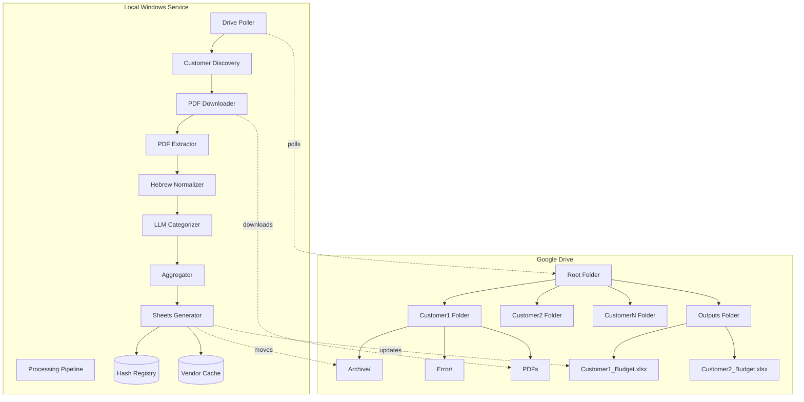

# Design Document

## Overview

BudgetFlow is a multi-customer automated budget processing system that runs as a Windows background service. The system monitors a hierarchical Google Drive folder structure where each customer has a dedicated folder for uploading PDF bank statements. The system processes these statements through a pipeline of PDF extraction, Hebrew text normalization, AI-powered transaction categorization, and automated Google Sheets report generation. All customer reports are centralized in an Outputs folder while maintaining complete data isolation between customers.

### Key Design Principles

- **Customer Isolation**: Each customer's data, processing state, and reports are completely isolated
- **Scalability**: Adding new customers requires only creating a new folder - no code changes
- **Fault Tolerance**: Errors in one customer's processing do not affect other customers
- **Auditability**: Complete transaction history and processing logs per customer
- **Security**: Local-only sensitive data processing with encrypted credentials

## Architecture

### System Architecture Diagram



### Component Architecture

The system follows a pipeline architecture with the following layers:

1. **Discovery Layer**: Identifies customers and new files
2. **Extraction Layer**: Converts PDFs to structured text
3. **Intelligence Layer**: Categorizes transactions using AI
4. **Persistence Layer**: Updates Google Sheets reports
5. **Orchestration Layer**: Manages the entire workflow

## Components and Interfaces

### 1. Configuration Manager

**Responsibility**: Manages system configuration and credentials

**Storage Location**: `%LOCALAPPDATA%\BudgetFlow\config.json`

**Configuration Schema**:
```json
{
  "gemini_api_key": "encrypted_key",
  "service_account_path": "path/to/credentials.json",
  "root_folder_id": "drive_folder_id",
  "polling_interval_minutes": 5,
  "log_level": "INFO",
  "max_concurrent_customers": 3
}
```

**Interface**:
```python
class ConfigManager:
    def load_config() -> Config
    def save_config(config: Config) -> None
    def validate_config() -> ValidationResult
    def encrypt_sensitive_data(data: str) -> str
    def decrypt_sensitive_data(data: str) -> str
```

### 2. Drive Poller

**Responsibility**: Discovers customers and monitors for new PDF files

**Polling Strategy**:
- Scan Root Folder for subfolders (excluding "Outputs")
- Each subfolder name becomes a Customer Identifier
- Within each customer folder, list PDF files
- Compare against Hash Registry to identify new files

**Interface**:
```python
class DrivePoller:
    def discover_customers() -> List[Customer]
    def scan_customer_folder(customer_id: str) -> List[PDFFile]
    def download_pdf(file_id: str, customer_id: str) -> LocalPath
    def move_to_archive(file_id: str, customer_id: str) -> None
    def move_to_error(file_id: str, customer_id: str) -> None
    def ensure_customer_structure(customer_id: str) -> None
```

**Customer Discovery Logic**:
```python
def discover_customers():
    folders = drive.list_folders(root_folder_id)
    customers = []
    for folder in folders:
        if folder.name == "Outputs":
            continue
        customer = Customer(
            id=folder.name,
            folder_id=folder.id,
            archive_folder_id=get_or_create_subfolder(folder.id, "Archive"),
            error_folder_id=get_or_create_subfolder(folder.id, "Error")
        )
        customers.append(customer)
    return customers
```

### 3. PDF Processor

**Responsibility**: Extracts text from PDF files with Hebrew support

**Extraction Strategy**:
1. Try `pdfplumber` (primary)
2. Fallback to `pypdf` if pdfplumber fails
3. Validate extracted text length (>100 chars)
4. Apply Hebrew normalization

**Interface**:
```python
class PDFProcessor:
    def extract_text(pdf_path: str) -> str
    def validate_extraction(text: str) -> bool
    def _extract_with_pdfplumber(pdf_path: str) -> str
    def _extract_with_pypdf(pdf_path: str) -> str
```

### 4. Hebrew Normalizer

**Responsibility**: Fixes Hebrew text directionality and encoding issues

**Normalization Steps**:
1. Detect text direction using Unicode bidi algorithm
2. Reverse lines if RTL detected
3. Normalize Unicode combining characters
4. Strip common PDF artifacts (headers, footers, page numbers)
5. Remove legal disclaimers

**Interface**:
```python
class HebrewNormalizer:
    def normalize(text: str) -> str
    def detect_direction(text: str) -> TextDirection
    def reverse_lines(text: str) -> str
    def strip_artifacts(text: str) -> str
```

### 5. LLM Categorizer

**Responsibility**: Extracts structured transactions and assigns categories

**LLM Configuration**:
- Model: Gemini 1.5 Flash
- Temperature: 0.1 (deterministic)
- Max tokens: 4096
- Response format: JSON
- Framework: LangChain with `init_chat_model`

**LLM Initialization**:
```python
from langchain.chat_models.base import init_chat_model, BaseChatModel

class LLMCategorizer:
    def __init__(self, api_key: str):
        self.model: BaseChatModel = init_chat_model(
            model="gemini-1.5-flash",
            model_provider="google_genai",
            api_key=api_key,
            temperature=0.1,
            max_tokens=4096
        )
```

**Prompt Structure**:
```
You are a financial transaction parser for Hebrew bank statements.

Extract all transactions from the following statement text and return a JSON array.

Categories (use EXACTLY these names):
{category_list}

For each transaction, provide:
- date: DD/MM/YYYY format
- description: original Hebrew description
- amount: negative for expenses, positive for income
- category: one of the categories above

Statement text:
{statement_text}

Return ONLY valid JSON, no explanations.
```

**Interface**:
```python
class LLMCategorizer:
    def __init__(self, api_key: str) -> None
    def extract_transactions(text: str, customer_id: str) -> List[Transaction]
    def assign_category(description: str, customer_id: str) -> str
    def infer_month(transactions: List[Transaction]) -> int
    def _check_vendor_cache(description: str, customer_id: str) -> Optional[str]
    def _update_vendor_cache(description: str, category: str, customer_id: str) -> None
```

**Transaction Schema**:
```python
@dataclass
class Transaction:
    date: datetime
    description: str
    amount: Decimal
    category: str
    raw_text: str
```

### 6. Aggregator

**Responsibility**: Groups transactions by category and month

**Aggregation Logic**:
```python
def aggregate_transactions(transactions: List[Transaction]) -> Dict[str, Decimal]:
    month = infer_month(transactions)
    aggregated = defaultdict(Decimal)
    
    for txn in transactions:
        aggregated[txn.category] += txn.amount
    
    return {
        "month": month,
        "totals": dict(aggregated),
        "transactions": transactions
    }
```

**Interface**:
```python
class Aggregator:
    def aggregate(transactions: List[Transaction]) -> AggregatedData
    def infer_month(transactions: List[Transaction]) -> int
```

### 7. Sheets Generator

**Responsibility**: Creates and updates customer-specific Google Sheets reports

**Report Structure**:
- **Budget Tab**: Category rows × Month columns with totals
- **Raw Data Tab**: Detailed transaction log

**Budget Tab Layout**:
```
| Category ID | Category Name          | Month 1 | Month 2 | ... | Month 12 |
|-------------|------------------------|---------|---------|-----|----------|
| INC001      | אמא                    | 5000    | 5000    | ... | 5000     |
| INC002      | אבא                    | 8000    | 8000    | ... | 8000     |
| FIX001      | דיור/שכר דירה         | -3500   | -3500   | ... | -3500    |
| VAR001      | סופר (מזון וטואלטיקה) | -2100   | -2350   | ... | -2200    |
```

**Update Strategy**:
1. Locate Customer Report in Outputs folder by name pattern
2. If not exists, create from template
3. Find month column by header text (e.g., "חודש 5")
4. For each category:
   - Find row by Category ID (Column B)
   - Read existing value
   - Add new amount (additive update)
   - Write back to cell
5. Append transactions to Raw Data tab

**Interface**:
```python
class SheetsGenerator:
    def get_or_create_report(customer_id: str) -> Spreadsheet
    def update_budget(customer_id: str, month: int, aggregated: Dict[str, Decimal]) -> None
    def append_raw_data(customer_id: str, transactions: List[Transaction]) -> None
    def validate_structure(spreadsheet: Spreadsheet) -> bool
    def _find_month_column(sheet: Worksheet, month: int) -> int
    def _find_category_row(sheet: Worksheet, category: str) -> int
```

### 8. Hash Registry

**Responsibility**: Tracks processed files to prevent duplicates

**Storage**: SQLite database at `%LOCALAPPDATA%\BudgetFlow\registry.db`

**Schema**:
```sql
CREATE TABLE processed_files (
    id INTEGER PRIMARY KEY,
    customer_id TEXT NOT NULL,
    file_hash TEXT NOT NULL,
    file_name TEXT NOT NULL,
    processed_at TIMESTAMP DEFAULT CURRENT_TIMESTAMP,
    status TEXT CHECK(status IN ('success', 'error')),
    UNIQUE(customer_id, file_hash)
);

CREATE INDEX idx_customer_hash ON processed_files(customer_id, file_hash);
```

**Interface**:
```python
class HashRegistry:
    def is_processed(customer_id: str, file_hash: str) -> bool
    def mark_processed(customer_id: str, file_hash: str, file_name: str, status: str) -> None
    def get_customer_history(customer_id: str) -> List[ProcessedFile]
```

### 9. Vendor Cache

**Responsibility**: Stores learned vendor-to-category mappings per customer

**Storage**: JSON files at `%LOCALAPPDATA%\BudgetFlow\vendors\{customer_id}.json`

**Schema**:
```json
{
  "שופרסל": "סופר (מזון וטואלטיקה)",
  "רמי לוי": "סופר (מזון וטואלטיקה)",
  "דלק": "רכב (דלק, חניה)",
  "סלקום": "טלפונים"
}
```

**Lookup Strategy**:
1. Normalize vendor name (lowercase, strip whitespace)
2. Check exact match
3. Check fuzzy match (Levenshtein distance < 3)
4. Return category or None

**Interface**:
```python
class VendorCache:
    def lookup(customer_id: str, vendor: str) -> Optional[str]
    def add_mapping(customer_id: str, vendor: str, category: str) -> None
    def get_all_mappings(customer_id: str) -> Dict[str, str]
```

### 10. Processing Orchestrator

**Responsibility**: Coordinates the entire processing pipeline

**Workflow**:
```python
def process_customer(customer: Customer):
    try:
        # Discover new files
        pdf_files = drive_poller.scan_customer_folder(customer.id)
        
        for pdf_file in pdf_files:
            # Check if already processed
            file_hash = calculate_hash(pdf_file)
            if hash_registry.is_processed(customer.id, file_hash):
                drive_poller.move_to_duplicates(pdf_file.id, customer.id)
                continue
            
            # Download and process
            local_path = drive_poller.download_pdf(pdf_file.id, customer.id)
            
            try:
                # Extract and normalize
                text = pdf_processor.extract_text(local_path)
                normalized = hebrew_normalizer.normalize(text)
                
                # Categorize
                transactions = llm_categorizer.extract_transactions(normalized, customer.id)
                
                # Aggregate
                aggregated = aggregator.aggregate(transactions)
                
                # Update sheet
                sheets_generator.update_budget(customer.id, aggregated["month"], aggregated["totals"])
                sheets_generator.append_raw_data(customer.id, aggregated["transactions"])
                
                # Archive
                drive_poller.move_to_archive(pdf_file.id, customer.id)
                hash_registry.mark_processed(customer.id, file_hash, pdf_file.name, "success")
                
            except Exception as e:
                logger.error(f"Failed to process {pdf_file.name} for {customer.id}: {e}")
                drive_poller.move_to_error(pdf_file.id, customer.id)
                hash_registry.mark_processed(customer.id, file_hash, pdf_file.name, "error")
            
            finally:
                cleanup_temp_file(local_path)
                
    except Exception as e:
        logger.error(f"Failed to process customer {customer.id}: {e}")
```

**Interface**:
```python
class ProcessingOrchestrator:
    def run_polling_cycle() -> None
    def process_customer(customer: Customer) -> ProcessingResult
    def process_pdf(customer: Customer, pdf_file: PDFFile) -> None
```

## Data Models

### Customer
```python
@dataclass
class Customer:
    id: str  # Folder name
    folder_id: str  # Drive folder ID
    archive_folder_id: str
    error_folder_id: str
    report_id: Optional[str]  # Spreadsheet ID
```

### PDFFile
```python
@dataclass
class PDFFile:
    id: str  # Drive file ID
    name: str
    size: int
    created_time: datetime
    hash: str
```

### Transaction
```python
@dataclass
class Transaction:
    date: datetime
    description: str
    amount: Decimal
    category: str
    raw_text: str
```

### AggregatedData
```python
@dataclass
class AggregatedData:
    customer_id: str
    month: int
    totals: Dict[str, Decimal]  # category -> amount
    transactions: List[Transaction]
```

### ProcessingResult
```python
@dataclass
class ProcessingResult:
    customer_id: str
    files_processed: int
    files_failed: int
    transactions_extracted: int
    duration_seconds: float
```

## Error Handling

### Error Categories

1. **Configuration Errors**: Invalid API keys, missing credentials
   - Action: Log critical error, halt service, notify user

2. **Network Errors**: Drive API failures, timeout
   - Action: Retry with exponential backoff (max 3 attempts), continue with next customer

3. **PDF Extraction Errors**: Corrupted PDF, scanned document
   - Action: Move to Error folder, log warning, continue

4. **LLM Errors**: API rate limit, invalid response
   - Action: Retry once, if fails move to Error folder, continue

5. **Sheets Errors**: Invalid structure, permission denied
   - Action: Log critical error for that customer, skip customer, continue with others

6. **File System Errors**: Disk full, permission denied
   - Action: Log critical error, pause processing, notify user

### Error Recovery Strategy

```python
def process_with_retry(func, max_retries=3, backoff_factor=2):
    for attempt in range(max_retries):
        try:
            return func()
        except RetryableError as e:
            if attempt == max_retries - 1:
                raise
            wait_time = backoff_factor ** attempt
            time.sleep(wait_time)
            logger.warning(f"Retry {attempt + 1}/{max_retries} after {wait_time}s")
```

### Logging Strategy

**Log Levels**:
- **DEBUG**: Detailed processing steps
- **INFO**: Processing start/end, file counts
- **WARNING**: Vendor not in cache, retry attempts
- **ERROR**: PDF extraction failed, LLM errors
- **CRITICAL**: Configuration invalid, service cannot continue

**Log Format**:
```
2025-11-19 14:32:15 [INFO] [customer:john_doe] Processing started: 3 new files
2025-11-19 14:32:18 [WARNING] [customer:john_doe] Vendor 'unknown_store' not in cache
2025-11-19 14:32:22 [INFO] [customer:john_doe] Updated budget: Month 11, 45 transactions
2025-11-19 14:32:23 [ERROR] [customer:jane_smith] PDF extraction failed: corrupted file
```

## Testing Strategy

### Unit Tests

**Coverage Areas**:
- Configuration encryption/decryption
- PDF text extraction with sample files
- Hebrew normalization with test cases
- Transaction parsing and validation
- Category matching logic
- Aggregation calculations
- Hash computation

**Test Files**:
```
tests/
├── test_config.py
├── test_pdf_processor.py
├── test_hebrew_normalizer.py
├── test_llm_categorizer.py
├── test_aggregator.py
├── test_sheets_generator.py
├── test_hash_registry.py
└── fixtures/
    ├── sample_statement.pdf
    ├── hebrew_text_samples.txt
    └── mock_responses.json
```

### Integration Tests

**Test Scenarios**:
1. End-to-end processing with mock Drive and Sheets APIs
2. Multi-customer concurrent processing
3. Error handling and recovery
4. Duplicate detection
5. Customer discovery and initialization

### Manual Testing Checklist

- [ ] Setup wizard completes successfully
- [ ] New customer folder auto-initializes
- [ ] PDF upload triggers processing
- [ ] Hebrew statements parse correctly
- [ ] Categories match expected values
- [ ] Sheet updates are additive
- [ ] Raw data tab populates
- [ ] Duplicate files skip processing
- [ ] Error files move to Error folder
- [ ] Service survives reboot
- [ ] Logs contain useful information

## Performance Considerations

### Optimization Strategies

1. **Concurrent Processing**: Process multiple customers in parallel (configurable limit)
2. **Batch API Calls**: Group Drive API calls to reduce latency
3. **Caching**: Cache Drive folder structures and Sheet metadata
4. **Lazy Loading**: Load vendor cache only when needed
5. **Connection Pooling**: Reuse HTTP connections for API calls

### Performance Targets

- **Polling Cycle**: < 30 seconds for 10 customers
- **PDF Processing**: < 5 seconds per file (excluding LLM)
- **LLM Categorization**: < 10 seconds per statement
- **Sheet Update**: < 3 seconds per customer
- **Memory Usage**: < 500 MB with 20 customers

### Scalability Limits

- **Max Customers**: 100 (limited by polling frequency)
- **Max Concurrent Processing**: 5 customers
- **Max PDF Size**: 10 MB
- **Max Transactions per Statement**: 500

## Security Considerations

### Data Protection

1. **Credentials**: Encrypted with Windows DPAPI
2. **Temporary Files**: Stored in user-specific AppData, deleted after processing
3. **Drive Permissions**: Service account only, no public sharing
4. **Logs**: No sensitive data (amounts, descriptions) in logs

### Access Control

1. **Service Account**: Minimal permissions (Drive read/write, Sheets edit)
2. **File Permissions**: Config and credentials readable only by current user
3. **Database**: SQLite file with user-only permissions

### Audit Trail

1. **Hash Registry**: Complete history of processed files
2. **Raw Data Tab**: All transactions with timestamps
3. **Logs**: Processing events with customer context

## Deployment

### System Requirements

- **OS**: Windows 10/11 (64-bit)
- **Python**: 3.11+ (bundled in EXE)
- **RAM**: 2 GB minimum
- **Disk**: 500 MB for application + logs
- **Network**: Internet connection for API access

### Installation Steps

1. Run `BudgetFlowSetup.exe`
2. Complete setup wizard
3. Service auto-starts and registers with Task Scheduler
4. Verify first polling cycle in logs

### Windows Service Configuration

**Task Scheduler Settings**:
- Trigger: At system startup
- Run whether user is logged on or not
- Run with highest privileges
- Restart on failure (3 attempts, 1 minute interval)

### Monitoring

**Health Checks**:
- Heartbeat log entry every polling cycle
- Daily summary email (optional)
- Error count threshold alerts

**Maintenance**:
- Log rotation (keep 30 days)
- Database vacuum (weekly)
- Vendor cache backup (daily)

## Future Enhancements

### Phase 2 Features

1. **Centralized Input Folder**: Automatic customer detection from statement content
2. **OCR Support**: Process scanned PDFs using Tesseract
3. **Multi-currency**: Support for foreign currency statements
4. **Budget Alerts**: Email notifications for overspending
5. **Web Dashboard**: View processing status and reports
6. **Mobile App**: Upload PDFs directly from phone camera

### Technical Debt

1. Replace polling with Drive push notifications (webhooks)
2. Migrate from SQLite to PostgreSQL for better concurrency
3. Add Prometheus metrics for monitoring
4. Implement distributed processing for 100+ customers
